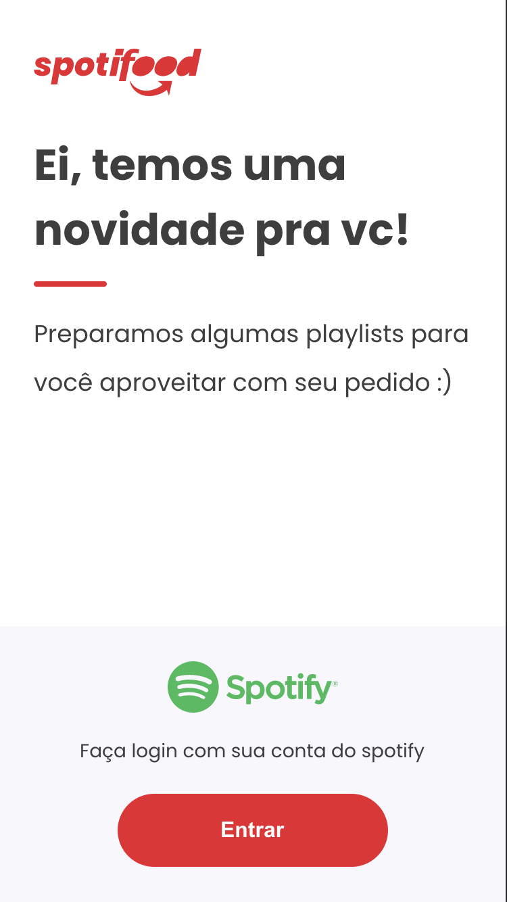
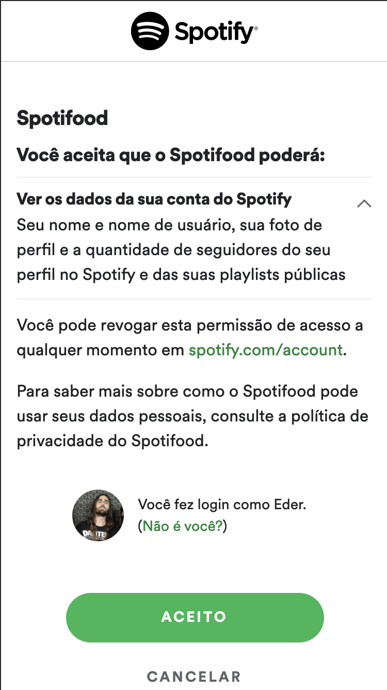
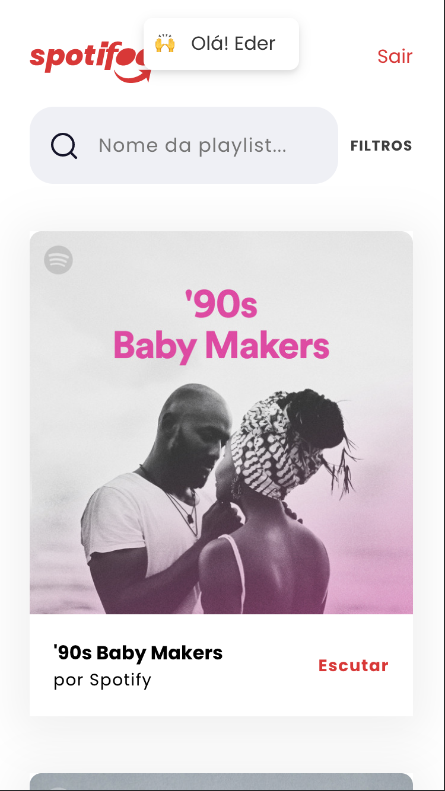
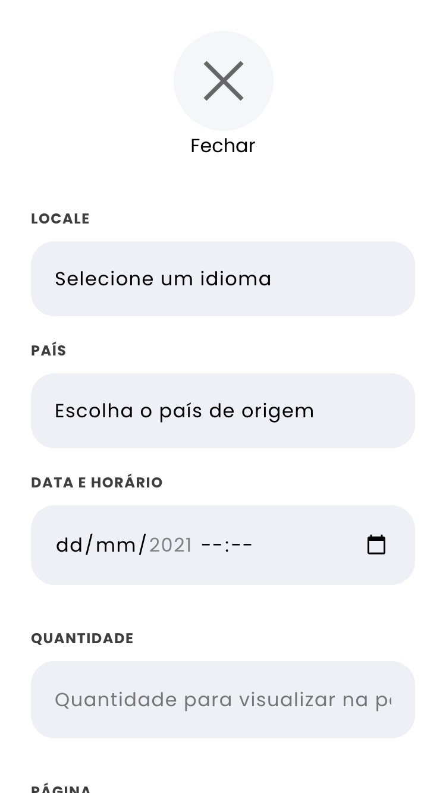
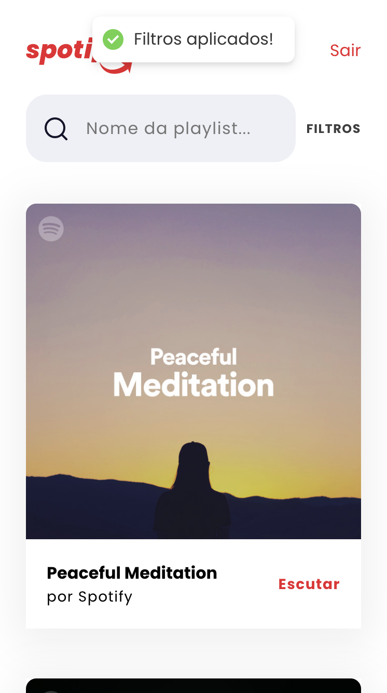
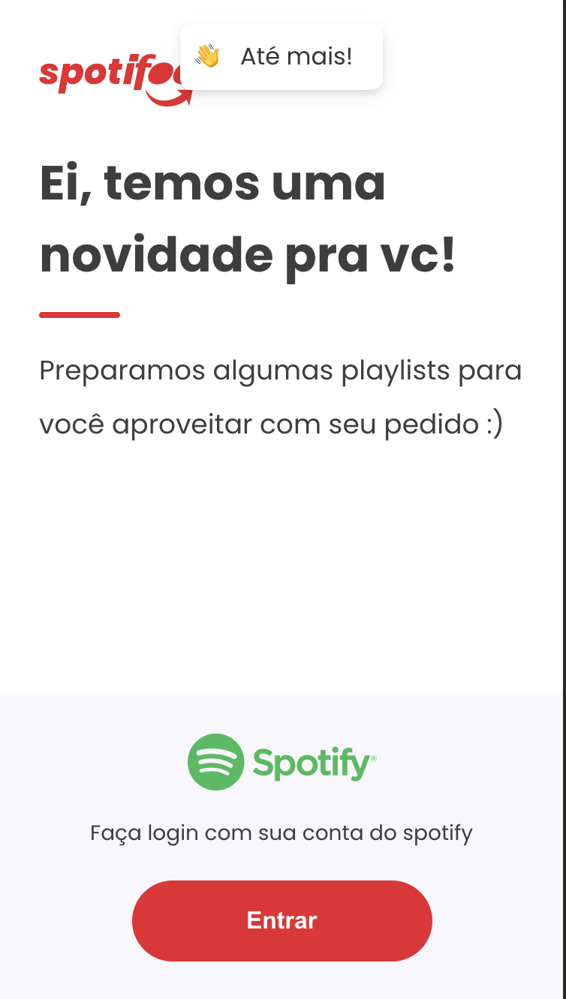

<h1 align="center"></h1>

<p align="center">
  <a href="https://lerna.js.org/">
    
  </a>
  <a href="http://commitizen.github.io/cz-cli/">
	  
  </a>
  <a href="https://conventionalcommits.org">
	  
  </a>
</p>


## Demo

Front end app: https://spotifood-ten.vercel.app/#/

Storybook: https://spotifood-components.vercel.app/?path=/story/components-button--primary

Figma (Design by me): https://www.figma.com/file/OIo3gx7ydjfIOC6oSI9A0a/Spotifood

## Features

- [x] Login page
- [x] [Spotify Authorization Scopes](https://developer.spotify.com/documentation/general/guides/scopes/)
- [x] Home page with Spotify featured playlist
- [x] SWR - HTTP cache invalidation strategy - See more at [SWR](https://swr.vercel.app/)
- [x] Search input
- [x] Filter options
- [x] Private Routes
- [x] Mobile first

## Todo

- [ ] Integration tests
- [ ] e2e tests

## About this app

I started building this app just following some business rules (#features) and the first thing that I decide to do was build pages, components, design tokens from scratch on Figma. [See the final implementation here](https://www.figma.com/file/OIo3gx7ydjfIOC6oSI9A0a/Spotifood?node-id=0%3A1).

Everything that I design was thinking in the best way to build a modular code in the front end project.

See design token object theme code here: [Design tokens](./packages/design-tokens)

See components code here: [Componens](./packages/design-tokens)

See pages code here: [Pages](./packages/app/src/pages)

## Preview




## Getting started

This is a monorepo repository using [Lerna](https://lerna.js.org/), [Commitzen](http://commitizen.github.io/cz-cli/) and [Conventional Commits](https://conventionalcommits.org) to maintain and manage component versions and for documentation, we use [Storybook](https://storybook.js.org/).

## 🛠 Stack

| ReactJS | Yarn | Lerna |
| :-: | :-: | :-: |
| [](https://reactjs.org/) | [](https://yarnpkg.com/) | [](https://github.com/lerna/lerna) |
| Jest | Testing Library | Styled Components |
| [](https://jestjs.io/en/) | [](https://testing-library.com/) | [](https://styled-components.com/) |

 ## 🌐 Links

Storybook components: https://spotifood-components.vercel.app/?path=/docs/components-button--primary 

Front end app: https://spotifood-ten.vercel.app

## ⚠️ Requirements

 - Node
 - Yarn
 - Lerna

## 🚀 Quick start

In the root folder run following commands _(all the below commands need to run on root folder)_:

Install all dependecies with:
```bash
  yarn 
```

To run the front end application [`@monorepo/cra`](./packages/cra) :
```bash
  yarn start
```

To run all components with storybook  [`@monorepo/ui-components`](./packages/ui-components) :
```bash
  yarn storybook
```

## 🗂 Monorepo structure

| Package                                               | Description                                                                            |
| -------------------------------------------------     | -------------------------------------------------------------------------------------- |
| [`@monorepo/design-tokens`](./packages/design-tokens) | Design tokens (colors, typography, attributes...)                                      |
| [`@common/**`](./packages/commons)                    | Common functions, images, lints (eslint, stylelint, prettier) and other generics setup |
| [`@monorepo/ui-components`](./packages/ui-components) | React library components with [stories](https://storybook.js.org/)                     |
| [`@monorepo/cra`](./packages/cra)                     | Front end application create with create-react-app                                     |

## 🚨 Code standard

- [JavaScript Standard Style](https://standardjs.com/) - Javascript styleguide
- [Prettier](https://prettier.io/) - Code formatter
- [ESLint](https://eslint.org/) - Lint to quickly find problems
- [Stylelint](https://stylelint.io/) - A mighty, modern linter that helps you avoid errors and enforce conventions in your styles

 ## ⌨️ Commands

| Command                        | Description                       |
| ------------------------------ | --------------------------------- |
| `yarn`                         | Install all dependencies          |
| `yarn start`                   | Run frontend app                  |
| `yarn test:ci`                 | Run all tests                     |
| `yarn storybook`               | Run storybook doc components      |
| `yarn watch:tokens`            | Watch design-tokens package       |
| `yarn watch:components`        | Watch ui-components package       |
| `yarn build-app`               | Build of front app([`@monorepo/cra`](./packages/cra)) and generate a directory with all assets in the following path: `packages/cra/build`      |
| `yarn build-storybook`         | Build of storybook with components([`@monorepo/ui-components`](./packages/ui-components)) and generate a directory with all assets in the following path: `packages/ui-components/public`      |
